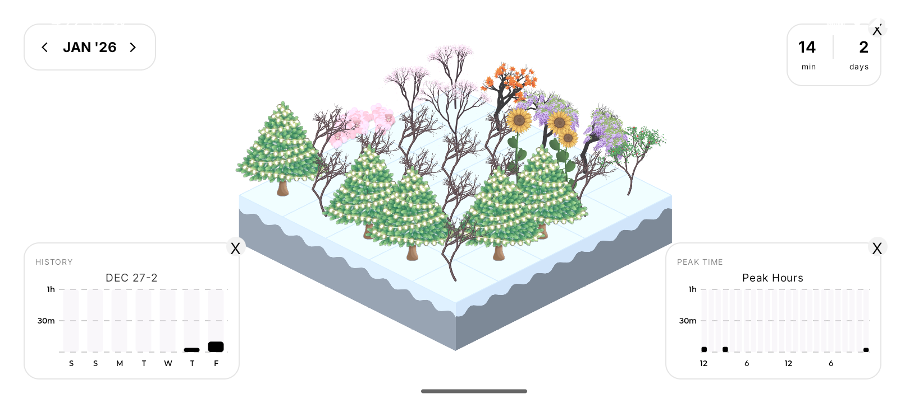
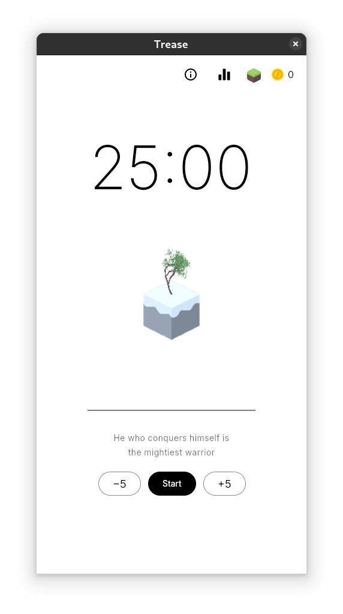
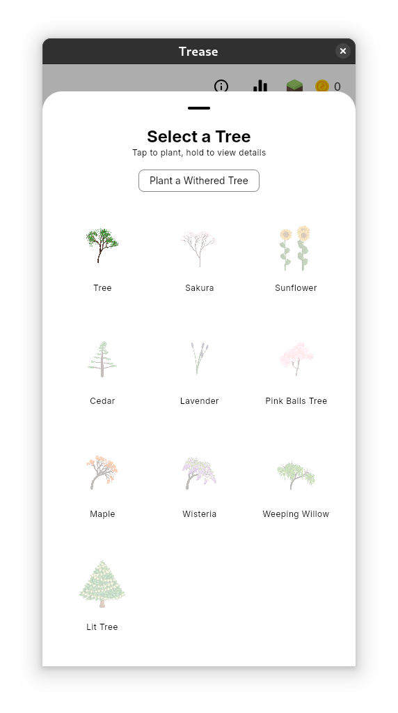
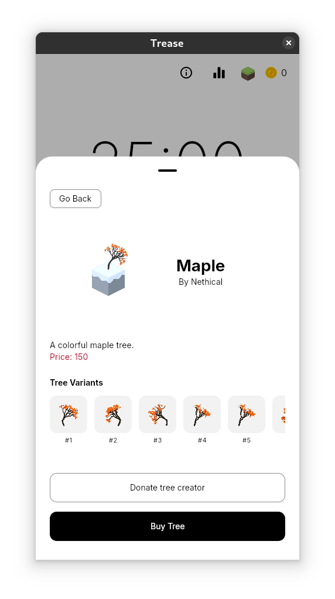
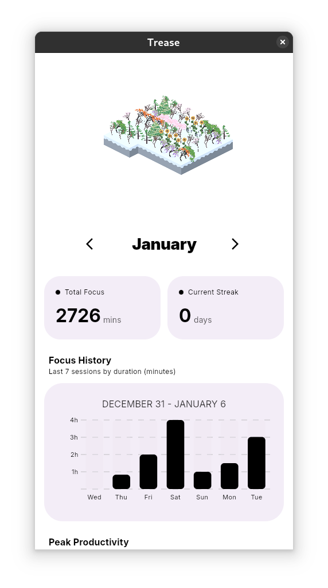
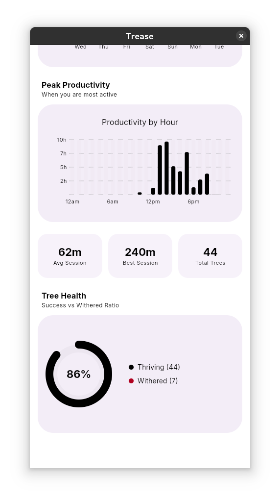

  
  <h1>Trease</h1>

  

    <strong>Cultivate focus. Reclaim your time.</strong>
  

  

    An open-source, cross-platform sanctuary for deep work.
  

  

    <a href="#download"><strong>Download</strong></a> ·
    <a href="#features"><strong>Features</strong></a> ·
    <a href="#contributing"><strong>Contributing</strong></a>
  

   

  
  
  

 

## About

**Trease** is an open-source focus tool.

When you want to focus, plant a seed. As time passes, the seed grows into a tree. However, if you cannot resist the temptation of using your phone and leave the app, your tree will wither.

> "The best time to plant a tree was 20 years ago. The second best time is now."

## Features

Trease is built with simplicity, privacy, and performance in mind using Kotlin Multiplatform.

* **Unified Experience:** A single, native codebase providing fluid performance on Android, Linux, Windows, iOS.
* **App Blocker:**  Block distractions when focusing (only available on android rn )
* **Detailed Analytics:** Insightful charts to track your focus distribution over weeks and months.
* **Visual Forest:** Watch your forest grow as you accumulate productive hours.
* **Open Source:** No hidden tracking, no ads, and completely transparent code.

## Visuals

  
  
  
  
  

## Download

Trease can be downloaded by installing the specific executable for your device from github release.
[Github Release](https://github.com/Trease-Focus/trease-app/releases)
## Development

Trease is built using **Kotlin Multiplatform (KMP)** and **Compose Multiplatform**.

## Contributing

We welcome contributions from the community. Whether it is a bug fix, a new feature, or design improvements, your help is appreciated.

## License

Trease is open-source software licensed under the [GNU License](LICENSE).
All of trease artworks is licensed under the same license too.
---

Made by [Nethical](https://github.com/nethical6) 
